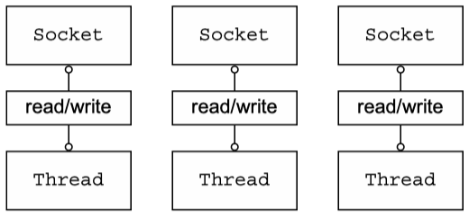
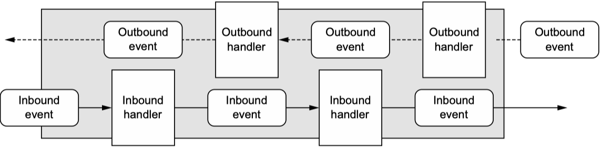

# 1. Netty - asynchronous and event-driven

> Netty is an asynchronous event-driven network application framework for rapid development of maintainable high
> performance protocol servers & clients.

High-performance system such as that can scale up to 150,000 concurrent users with no loss of performance require
expertise in several areas: networking, multithreading, and concurrency. Netty captures this domain knowledge.

## 1.1 Networking in Java

The first Java APIs (`java.net`) supported only the blocking functions provided by the native system socket libraries.

```java
public class BlockingIoExample {
  public void serve(int portNumber) throws IOException {
    ServerSocket serverSocket = new ServerSocket(portNumber);
    Socket clientSocket = serverSocket.accept();
    BufferedReader in = new BufferedReader(new InputStreamReader(clientSocket.getInputStream()));
    PrintWriter out = new PrintWriter(clientSocket.getOutputStream(), true);
    String request, response;
    while ((request = in.readLine()) != null) {
      if ("Done".equals(request)) {
        break;
      }
      response = processRequest(request);
      out.println(response);
    }
  }

  private String processRequest(String request) {
    return "Processed";
  }
}
```

- `accept()` blocks until a connection is established on the `ServerSocket`, then returns a new `Socket` for
  communication between the client and server. The `ServerSocket` then resumes listening for incoming connections.
- `readLine()` blocks until a string terminated by a linefeed or carriage return is read in.

This code will handle only one connection at a time. To manage multiple, concurrent clients, you need to allocate a new
`Thread` for each new client `Socket`.



### 1.1.1 Java NIO

### 1.1.2 Selectors

## 1.2 Introducing Netty

## 1.3 Netty's core components

- `Channels`
- Callbacks
- `Futures`
- Events and handlers

### 1.3.1 Channels

A `Channel` is a basic construct of Java NIO. It represents
> an open connection to an entity such as a hardware device, a file, a network socket, or a program component that is
> capable of performing one or more distinct I/O operations, for example reading or writing. (
>
Source: [Java Platform, Standard Edition 23 API Specification, java.nio.channels, Interface Channel](https://docs.oracle.com/en/java/javase/23/docs/api/java.base/java/nio/channels/Channel.html))

Think of a `Channel` as a vehicle for incoming (inbound) and outgoing (outbound) data. As such, it can be open or
closed, connected or disconnected.

### 1.3.2 Callbacks

A _callback_ is simply a method, a reference to which has been provided to another method.

Netty uses callbacks internally when handling events; when a callback is triggered the event can be handled by an
implementation of `interface ChannelHandler`. In the next example, when a new connection has been established the
`ChannelHandler` callback `channelActive()` will be called and will print a message.

```java
public class ConnectHandler extends ChannelInboundHandlerAdapter {
  @Override
  public void channelActive(ChannelHandlerContext ctx) throws Exception {
    System.out.println("Client " + ctx.channel().remoteAddress() + " connected");
  }
}
```

### 1.3.3 Futures

A `Future` object acts as a placeholder for the result of an asynchronous operation; it will complete at some point in
the future and provide access to the result.

The JDK ships with `interface java.util.concurrent.Future`, but the provided implementation allow you only to check
manually whether the operation has completed or to block until it does.

Netty's `ChannelFuture` provides additional methods that allow us to register one or more `ChannelFutureListener`
instances. The listener's callback method, `operationComplete()`, is called when the operation has completed. The
listener can then determine whether the operation completed successfully or with an error.

Each of Netty's outbound I/O operations returns a `ChannelFuture`; none of them block.

```java
public class ConnectExample {
  private static final Channel CHANNEL_FROM_SOMEWHERE = new NioSocketChannel();

  public static void connect() {
    Channel channel = CHANNEL_FROM_SOMEWHERE;
    // Connects asynchronously to a remote peer.
    ChannelFuture future = channel.connect(new InetSocketAddress("192.168.0.1", 25));

    // Registers a ChannelFutureListener to be notified once the operation completes.
    future.addListener(new ChannelFutureListener() {
      @Override
      public void operationComplete(ChannelFuture future) throws Exception {
        if (future.isSuccess()) {
          // If the operation is successful, creates a ByteBuf to hold the data.
          ByteBuf buffer = Unpooled.copiedBuffer("Hello", Charset.defaultCharset());
          // Sends the data asynchronously to the remote peer. Returns a ChannelFuture.
          ChannelFuture wf = future.channel().writeAndFlush(buffer);
          // ...
        } else {
          // If an error occured, accesses the Throwable that describes the cause.
          Throwable cause = future.cause();
          cause.printStackTrace();
        }
      }
    });
  }
}
```

### 1.3.4 Events and handlers

Netty uses distinct events to notify us about changes of state or the status of operations.

Every event can be dispatched to a user-implemented method of a handler class. The following figure shows how an event
can be handled by a chain of such event handlers.



Netty's `ChannelHandler` provides the basic abstraction for handlers like the ones shown above.

### 1.3.5 Putting it all together

#### Futures, Callbacks, and Handlers

#### Selectors, Events, and Event Loops
